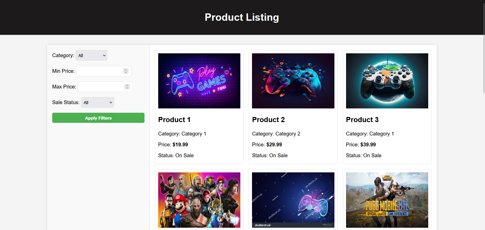

# Product Listing App

This project is a simple Product Listing web application built using PHP, MySQL, and JavaScript. It allows users to filter and paginate through a list of products stored in a MySQL database.

## Screenshot



## Features

- Display products with details such as name, category, price, and sale status.
- Filter products by category, price range, and sale status.
- Pagination to navigate through the product list.

## Technologies Used

- **Frontend**: HTML, CSS, JavaScript
- **Backend**: PHP
- **Database**: MySQL

## Setup Instructions

To run this project locally, follow these steps:

1. **Clone the repository:**

   ```bash
   git clone https://github.com/thefarhanahmad/Product-Listing-App.git
   cd Product-Listing-App
   ```

2. **Database Setup:**

- Create a MySQL database named product_listing_db.
- Import the products.sql file provided in the repository to set up the products table.

3. **PHP Configuration:**

- Update db_connection.php with your MySQL database credentials.

4. **Run the Application:**

- Start your local server (e.g., Apache, PHP built-in server).
- Navigate to index.php in your web browser to view the application.

## File Structure

product-listing-app/
│
├── index.php # Main page displaying products and filters
├── get_products.php # PHP script to fetch products based on filters
├── db_connection.php # PHP script for database connection
├── style.css # CSS file for styling
├── products.sql # SQL script to create products table
└── README.md # Project documentation

## Usage

- Use the sidebar filters to narrow down the list of products based on category, price range, and sale status.
- Click on pagination buttons to navigate through different pages of products.
